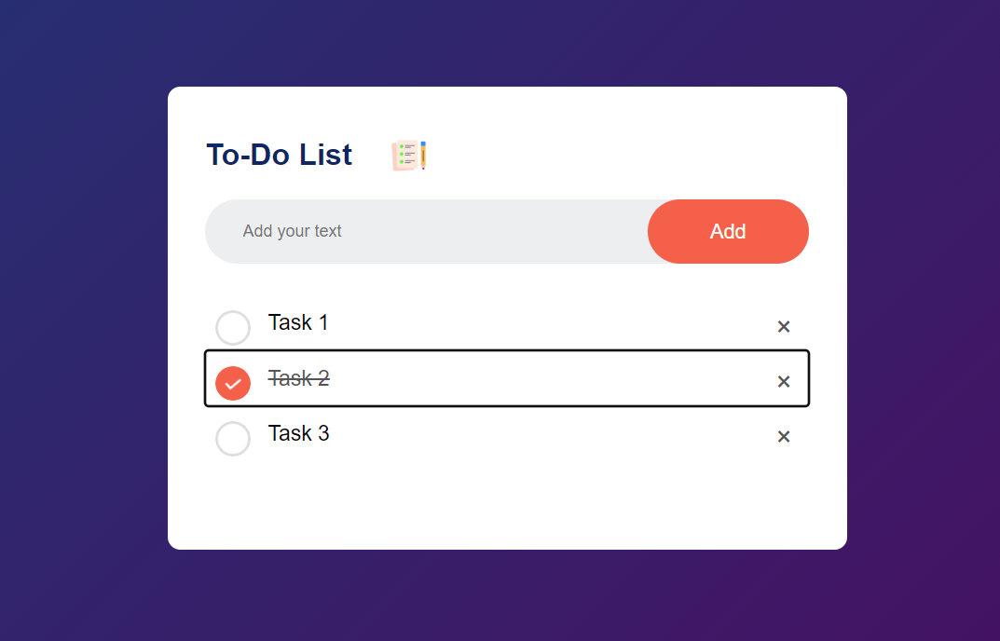

# Simple To-Do App

This is a simple to-do application that allows users to add, check, and remove tasks.

## Table of Contents
- [Features](#features)
- [Demo](#demo)
- [Screenshot](#screenshot)
- [Getting Started](#getting-started)
- [Usage](#usage)
- [Technologies Used](#technologies-used)

## Features
- Add tasks
- Check/uncheck tasks
- Remove tasks

## Demo
You can view the live demo [here](https://osama2401.github.io/JS-Projects/Simple_ToDo_App/).

## Screenshot

## Getting Started

### Prerequisites

To run this project, you need a modern web browser that supports JavaScript and HTML5.

### Installation

1. Clone the repository.
2. Open the project in your code editor.
3. Open `index.html` in your web browser to view the project.

## Usage

1. Enter a task in the input box.
2. Click the "Add Task" button to add the task to the list.
3. Click on a task to check/uncheck it.
4. Click on the "×" icon next to a task to remove it.

## Technologies Used
- HTML5
- CSS3
- JavaScript
